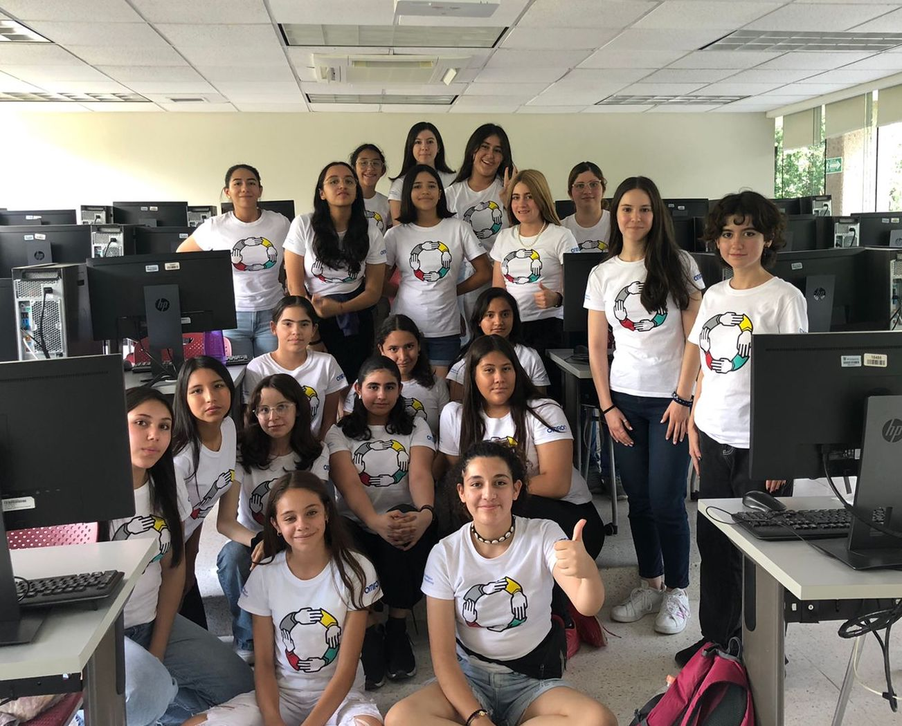
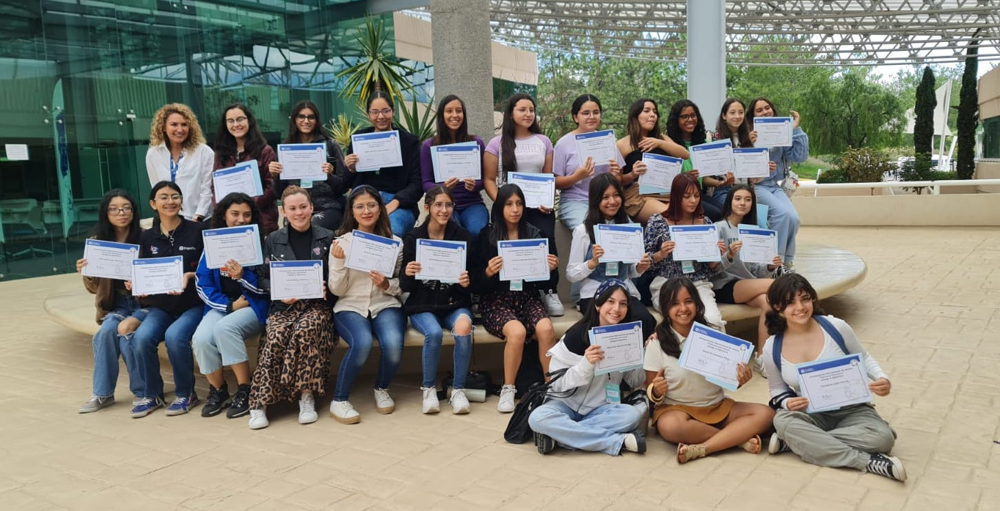
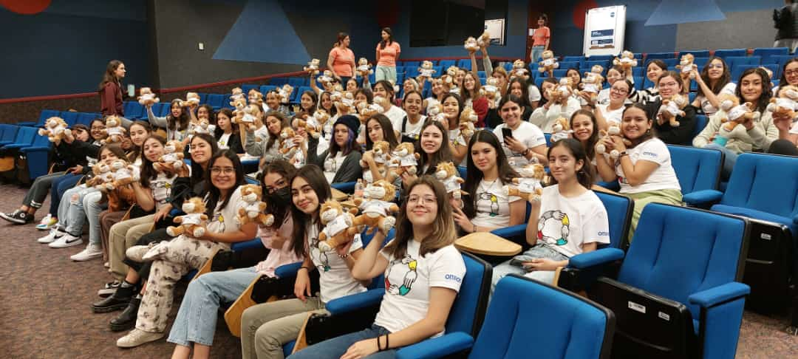
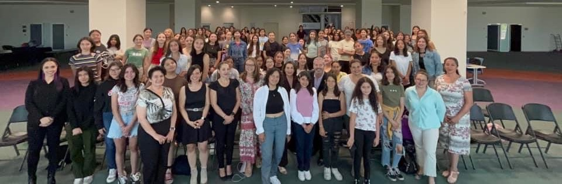

# Bienvenidos a Bootcamps!

Entre las iniciativas que Patrones Hermosos promueve se encuentran los Bootcamps.
El Bootcamp Pensamiento Computacional de Patrones Hermosos, por ejemplo, es un programa enfocado al desarrollo de habilidades de pensamiento computacional en niñas latinoamericanas entre los 13 y 17 años de edad. Con éste, se busca motivar en este sector el estudio de carreras STEM.

## Objetivos Generales
- Reducir la desigualdad de género, siendo 100% orientado a mujeres y personas no binarias. 
- Desarrollar habilidades de pensamiento algorítmico y computacional en mujeres jóvenes a través de un programa educativo de alto nivel, impartido por mujeres estudiantes del MIT y otras universidades prestigiosas. Esto permite explotar y difundir su talento de manera internacional. 
- Se busca promover la transformación de la economía mediante gente joven, cuyas habilidades desarrolladas, les ayuden a competir globalmente y acceder a más y mejores oportunidades de educación y trabajo.

# Ediciones de Bootcamps

## Campamentos: Edición Tec de Monterrey - VERANO 2023
Busca la sede que se encuentre más cercana a tí, ya puedes inscribirte como instructora o como participante al bootcamp de este verano 2023.  ¡Te esperamos!

 

 SEDE Autorizada 
 
  

  
  
 Instituto Tecnológico Autónomo de México (ITAM) 

  <table>
    <tr> <td>Ciudad</td>                       <td style="text-align: center">Álvaro Obregón</td> </tr>
    <tr> <td>Entidad Federativa</td>           <td style="text-align: center"> Ciudad de México (CDMX)</td> </tr>
    <tr> <td>País</td>                         <td style="text-align: center">México</td> </tr>
    <tr> <td>Fecha de inicio del programa</td> <td style="text-align: center">26/06/2023</td> </tr>
    <tr> <td>Informes con</td>                 <td style="text-align: center">Ana Lidia Franzoni Velázquez</td> </tr>
    <tr> <td>eMail</td>                        <td style="text-align: center">analidia@itam.mx</td> </tr>
    <tr> <td> <a href="https://forms.gle/APcudX9tRyBewv7a7">Registro Instructoras</a> </td> <td></td> </tr>
    <tr> <td> <a href="https://forms.gle/GLHPk8PRy7YtodSL9">Registro Participantes</a> </td> <td></td> </tr>
  </table>

  
  
 Instituto Tecnológico de Sonora. (ITSON) Campus Náinari  

  <table>
    <tr> <td>Ciudad</td>                       <td style="text-align: center">Ciudad Obregón</td> </tr>
    <tr> <td>Entidad Federativa</td>           <td style="text-align: center">Sonora</td> </tr>
    <tr> <td>País</td>                         <td style="text-align: center">México</td> </tr>
    <tr> <td>Fecha de inicio del programa</td> <td style="text-align: center">10/07/2023</td> </tr>
    <tr> <td>Informes con</td>                 <td style="text-align: center">Martha Eloisa Larrínaga Hernández</td> </tr>
    <tr> <td>eMail</td>                        <td style="text-align: center">martha.larrinaga@itson.edu.mx</td> </tr>
    <tr> <td> <a href="https://forms.gle/EyvZhgM8RTQEdJbHA">Registro Instructoras</a> </td> <td></td> </tr>
    <tr> <td> <a href="https://forms.gle/E3FR5QNQ5fX3PShN8">Registro Participantes</a> </td> <td></td> </tr>
  </table>
  

  
  
 Tecnológico de Monterrey. Campus Aguascalientes  

  
  <table>
    <tr> <td>Ciudad</td>                       <td style="text-align: center">Aguascalientes</td> </tr>
    <tr> <td>Entidad Federativa</td>                       <td style="text-align: center"> Aguascalientes</td> </tr>
    <tr> <td>País</td>                         <td style="text-align: center">México</td> </tr>
    <tr> <td>Fecha de inicio del programa</td> <td style="text-align: center">19/06/2023</td> </tr>
    <tr> <td>Informes con</td>                 <td style="text-align: center">María Elvira Alvarado Hernández</td> </tr>
    <tr> <td>eMail</td>                        <td style="text-align: center">m.elvirah@tec.mx</td> </tr>
    <tr> <td> <a href="https://forms.gle/w7t46MvbVc6UFbkn7">Registro Instructoras</a> </td> <td></td> </tr>
    <tr> <td> <a href="https://forms.gle/aAE3CVCWCjj3hPQD6">Registro Participantes</a> </td> <td></td> </tr>
  </table>

  
  
 Tecnológico de Monterrey. Campus Chihuahua 

  <table>
    <tr> <td>Ciudad</td>                       <td style="text-align: center">Chihuahua</td> </tr>
    <tr> <td>Ciudad</td>                       <td style="text-align: center"> Chihuahua</td> </tr>
    <tr> <td>País</td>                         <td style="text-align: center">México</td> </tr>
    <tr> <td>Fecha de inicio del programa</td> <td style="text-align: center">26/06/2023</td> </tr>
    <tr> <td>Informes con</td>                 <td style="text-align: center">Luisa A Márquez</td> </tr>
    <tr> <td>eMail</td>                        <td style="text-align: center">luisa.marquez@tec.mx</td> </tr>
    <tr> <td> <a href="https://forms.gle/w7t46MvbVc6UFbkn7">Registro Instructoras</a> </td> <td></td> </tr>
    <tr> <td> <a href="https://forms.gle/aAE3CVCWCjj3hPQD6">Registro Participantes</a> </td> <td></td> </tr>
  </table>

  
  
 Tecnológico de Monterrey. Campus Ciudad de México 

  
  <table>
    <tr> <td>Ciudad</td>                       <td style="text-align: center">Ciudad de México</td> </tr>
    <tr> <td>Ciudad</td>                       <td style="text-align: center"> Ciudad de México (CDMX)|
    <tr> <td>País</td>                         <td style="text-align: center">México</td> </tr>
    <tr> <td>Fecha de inicio del programa</td> <td style="text-align: center">03/07/2023</td> </tr>
    <tr> <td>Informes con</td>                 <td style="text-align: center">Mónica Elizabeth Jimenez Vega</td> </tr>
    <tr> <td>eMail</td>                        <td style="text-align: center">monijimenez@tec.mx</td> </tr>
    <tr> <td> <a href="https://forms.gle/w7t46MvbVc6UFbkn7">Registro Instructoras</a> </td> <td></td> </tr>
    <tr> <td> <a href="https://forms.gle/aAE3CVCWCjj3hPQD6">Registro Participantes</a> </td> <td></td> </tr>
  </table>

  
  
 Tecnológico de Monterrey. Campus Cuernavaca 

  
  <table>
    <tr> <td>Ciudad</td>                       <td style="text-align: center">Cuernavaca</td> </tr>
    <tr> <td>Ciudad</td>                       <td style="text-align: center"> Morelos</td> </tr>
    <tr> <td>País</td>                         <td style="text-align: center">México</td> </tr>
    <tr> <td>Fecha de inicio del programa</td> <td style="text-align: center">10/07/2023</td> </tr>
    <tr> <td>Informes con</td>                 <td style="text-align: center">Iyali Maria Curiel Enríquez</td> </tr>
    <tr> <td>eMail</td>                        <td style="text-align: center">iyali.curiel@tec.mx</td> </tr>
    <tr> <td> <a href="https://forms.gle/w7t46MvbVc6UFbkn7">Registro Instructoras</a> </td> <td></td> </tr>
    <tr> <td> <a href="https://forms.gle/aAE3CVCWCjj3hPQD6">Registro Participantes</a> </td> <td></td> </tr>
  </table>

  
 Tecnológico de Monterrey. Campus Estado de México 

  
  <table>
    <tr> <td>Ciudad</td>                       <td style="text-align: center">López Mateos</td> </tr>
    <tr> <td>Ciudad</td>                       <td style="text-align: center"> Estado de México</td> </tr>
    <tr> <td>País</td>                         <td style="text-align: center">México</td> </tr>
    <tr> <td>Fecha de inicio del programa</td> <td style="text-align: center">24/07/2023</td> </tr>
    <tr> <td>Informes con</td>                 <td style="text-align: center">Humberto Cárdenas Anaya</td> </tr>
    <tr> <td>eMail</td>                        <td style="text-align: center">hcardens@tec.mx</td> </tr>
    <tr> <td> <a href="https://forms.gle/w7t46MvbVc6UFbkn7">Registro Instructoras</a> </td> <td></td> </tr>
    <tr> <td> <a href="https://forms.gle/aAE3CVCWCjj3hPQD6">Registro Participantes</a> </td> <td></td> </tr>
  </table>

  
 Tecnológico de Monterrey. Campus Guadalajara 

  
  <table>
    <tr> <td>Ciudad</td>                       <td style="text-align: center">Zapopan</td> </tr>
    <tr> <td>Ciudad</td>                       <td style="text-align: center"> Jalisco</td> </tr>
    <tr> <td>País</td>                         <td style="text-align: center">México</td> </tr>
    <tr> <td>Fecha de inicio del programa</td> <td style="text-align: center">26/06/2023</td> </tr>
    <tr> <td>Informes con</td>                 <td style="text-align: center">Ana Raquel Sanromán</td> </tr>
    <tr> <td>eMail</td>                        <td style="text-align: center">ana.sanroman@tec.mx</td> </tr>
    <tr> <td> <a href="https://forms.gle/w7t46MvbVc6UFbkn7">Registro Instructoras</a> </td> <td></td> </tr>
    <tr> <td> <a href="https://forms.gle/aAE3CVCWCjj3hPQD6">Registro Participantes</a> </td> <td></td> </tr>
  </table>

  
 Tecnológico de Monterrey. Campus Laguna 

  
  <table>
    <tr> <td>Ciudad</td>                       <td style="text-align: center">Torreón</td> </tr>
    <tr> <td>Ciudad</td>                       <td style="text-align: center"> Coahuila de Zaragoza</td> </tr>
    <tr> <td>País</td>                         <td style="text-align: center">México</td> </tr>
    <tr> <td>Fecha de inicio del programa</td> <td style="text-align: center">26/06/2023</td> </tr>
    <tr> <td>Informes con</td>                 <td style="text-align: center">Ana Mónica Turcios Esquivel</td> </tr>
    <tr> <td>eMail</td>                        <td style="text-align: center"> monica.turcios@tec.mx</td> </tr>
    <tr> <td> <a href="https://forms.gle/w7t46MvbVc6UFbkn7">Registro Instructoras</a> </td> <td></td> </tr>
    <tr> <td> <a href="https://forms.gle/aAE3CVCWCjj3hPQD6">Registro Participantes</a> </td> <td></td> </tr>
  </table>

  
 Tecnológico de Monterrey. Campus Monterrey 

  
  <table>
    <tr> <td>Ciudad</td>                       <td style="text-align: center">Monterrey</td> </tr>
    <tr> <td>Ciudad</td>                       <td style="text-align: center"> Nuevo León</td> </tr>
    <tr> <td>País</td>                         <td style="text-align: center">México</td> </tr>
    <tr> <td>Fecha de inicio del programa</td> <td style="text-align: center">10/07/2023</td> </tr>
    <tr> <td>Informes con</td>                 <td style="text-align: center">María Guadalupe Roque</td> </tr>
    <tr> <td>eMail</td>                        <td style="text-align: center"> roque@tec.mx</td> </tr>
    <tr> <td> <a href="https://forms.gle/w7t46MvbVc6UFbkn7">Registro Instructoras</a> </td> <td></td> </tr>
    <tr> <td> <a href="https://forms.gle/aAE3CVCWCjj3hPQD6">Registro Participantes</a> </td> <td></td> </tr>
  </table>

  
 Tecnológico de Monterrey. Campus Morelia 

  
  <table>
    <tr> <td>Ciudad</td>                       <td style="text-align: center">Morelia</td> </tr>
    <tr> <td>Ciudad</td>                       <td style="text-align: center"> Michoacán de Ocampo</td> </tr>
    <tr> <td>País</td>                         <td style="text-align: center">México</td> </tr>
    <tr> <td>Fecha de inicio del programa</td> <td style="text-align: center">24/07/2023</td> </tr>
    <tr> <td>Informes con</td>                 <td style="text-align: center">Sandra Eugenia García Hernández</td> </tr>
    <tr> <td>eMail</td>                        <td style="text-align: center"> sandraeu@tec.mx</td> </tr>
    <tr> <td> <a href="https://forms.gle/w7t46MvbVc6UFbkn7">Registro Instructoras</a> </td> <td></td> </tr>
    <tr> <td> <a href="https://forms.gle/aAE3CVCWCjj3hPQD6">Registro Participantes</a> </td> <td></td> </tr>
  </table>

  
 Tecnológico de Monterrey. Campus Puebla 

  
  <table>
    <tr> <td>Ciudad</td>                       <td style="text-align: center">Puebla</td> </tr>
    <tr> <td>Ciudad</td>                       <td style="text-align: center"> Puebla</td> </tr>
    <tr> <td>País</td>                         <td style="text-align: center">México</td> </tr>
    <tr> <td>Fecha de inicio del programa</td> <td style="text-align: center">26/06/2023</td> </tr>
    <tr> <td>Informes con</td>                 <td style="text-align: center">Rosa Guadalupe Paredes Juárez</td> </tr>
    <tr> <td>eMail</td>                        <td style="text-align: center"> rgparedes@tec.mx</td> </tr>
    <tr> <td> <a href="https://forms.gle/w7t46MvbVc6UFbkn7">Registro Instructoras</a> </td> <td></td> </tr>
    <tr> <td> <a href="https://forms.gle/aAE3CVCWCjj3hPQD6">Registro Participantes</a> </td> <td></td> </tr>
  </table>

  
 Tecnológico de Monterrey. Campus Querétaro 

  
  <table>
    <tr> <td>Ciudad</td>                       <td style="text-align: center">Querétaro</td> </tr>
    <tr> <td>Ciudad</td>                       <td style="text-align: center"> Querétaro</td> </tr>
    <tr> <td>País</td>                         <td style="text-align: center">México</td> </tr>
    <tr> <td>Fecha de inicio del programa</td> <td style="text-align: center">26/06/2023</td> </tr>
    <tr> <td>Informes con</td>                 <td style="text-align: center">María Lule Salinas</td> </tr>
    <tr> <td>eMail</td>                        <td style="text-align: center"> mlule@tec.mx</td> </tr>
    <tr> <td> <a href="https://forms.gle/w7t46MvbVc6UFbkn7">Registro Instructoras</a> </td> <td></td> </tr>
    <tr> <td> <a href="https://forms.gle/aAE3CVCWCjj3hPQD6">Registro Participantes</a> </td> <td></td> </tr>
  </table>

  
 Tecnológico de Monterrey. Campus San Luis Potosí (PrepaTec) 

  
  <table>
    <tr> <td>Ciudad</td>                       <td style="text-align: center">San Luis Potosí</td> </tr>
    <tr> <td>Ciudad</td>                       <td style="text-align: center"> San Luis Potosí</td> </tr>
    <tr> <td>País</td>                         <td style="text-align: center">México</td> </tr>
    <tr> <td>Fecha de inicio del programa</td> <td style="text-align: center">26/06/2023</td> </tr>
    <tr> <td>Informes con</td>                 <td style="text-align: center">Brenda Cruz Zamora</td> </tr>
    <tr> <td>eMail</td>                        <td style="text-align: center"> brenda.cruz@tec.mx</td> </tr>
    <tr> <td> <a href="https://forms.gle/w7t46MvbVc6UFbkn7">Registro Instructoras</a> </td> <td></td> </tr>
    <tr> <td> <a href="https://forms.gle/aAE3CVCWCjj3hPQD6">Registro Participantes</a> </td> <td></td> </tr>
  </table>

  
 Tecnológico de Monterrey. Campus Toluca 

  
  <table>
    <tr> <td>Ciudad</td>                       <td style="text-align: center">Toluca</td> </tr>
    <tr> <td>Ciudad</td>                       <td style="text-align: center"> Estado de México</td> </tr>
    <tr> <td>País</td>                         <td style="text-align: center">México</td> </tr>
    <tr> <td>Fecha de inicio del programa</td> <td style="text-align: center">17/07/2023</td> </tr>
    <tr> <td>Informes con</td>                 <td style="text-align: center">Karla Berenice Coyote Aguirre</td> </tr>
    <tr> <td>eMail</td>                        <td style="text-align: center"> karlacoyote@tec.mx</td> </tr>
    <tr> <td> <a href="https://forms.gle/w7t46MvbVc6UFbkn7">Registro Instructoras</a> </td> <td></td> </tr>
    <tr> <td> <a href="https://forms.gle/aAE3CVCWCjj3hPQD6">Registro Participantes</a> </td> <td></td> </tr>
  </table>

  
 Tecnológico de Monterrey. Edición Virtual 

  
  <table>
    <tr> <td>Ciudad</td>                       <td style="text-align: center">Monterrey</td> </tr>
    <tr> <td>Ciudad</td>                       <td style="text-align: center"> Nuevo León</td> </tr>
    <tr> <td>País</td>                         <td style="text-align: center">México</td> </tr>
    <tr> <td>Fecha de inicio del programa</td> <td style="text-align: center">24/07/2023</td> </tr>
    <tr> <td>Informes con</td>                 <td style="text-align: center">María Yolanda Burgos López</td> </tr>
    <tr> <td>eMail</td>                        <td style="text-align: center"> yolanda.burgos@tec.mx</td> </tr>
    <tr> <td> <a href="https://forms.gle/w7t46MvbVc6UFbkn7">Registro Instructoras</a> </td> <td></td> </tr>
    <tr> <td> <a href="https://forms.gle/aAE3CVCWCjj3hPQD6">Registro Participantes</a> </td> <td></td> </tr>
  </table>

  
 Universidad Católica de Cuenca. Unidad Académica de Informática,   Ciencias de la Computación e Innovación Tecnológica 

  
  <table>
    <tr> <td>Ciudad</td>                       <td style="text-align: center">Cuenca</td> </tr>
    <tr> <td>País</td>                         <td style="text-align: center">Ecuador</td> </tr>
    <tr> <td>Fecha de inicio del programa</td> <td style="text-align: center">26/06/2023</td> </tr>
    <tr> <td>Informes con</td>                 <td style="text-align: center">Nathalia Peralta Vasconez</td> </tr>
    <tr> <td>eMail</td>                        <td style="text-align: center"> nathalia.peralta@ucacue.edu.ec</td> </tr>
    <tr> <td> <a href="https://forms.gle/GPDUbisxLKsCJfAS7">Registro Instructoras</a> </td> <td></td> </tr>
    <tr> <td> <a href="https://forms.gle/Y7MhaNkjKg6ktSdU7">Registro Participantes</a> </td> <td></td> </tr>
  </table>

  
 Universidad Tecmilenio. Campus Chihuahua 

  
  <table>
    <tr> <td>Ciudad</td>                       <td style="text-align: center">Chihuahua</td> </tr>
    <tr> <td>Ciudad</td>                       <td style="text-align: center"> Chihuahua</td> </tr>
    <tr> <td>País</td>                         <td style="text-align: center">México</td> </tr>
    <tr> <td>Fecha de inicio del programa</td> <td style="text-align: center">17/07/2023</td> </tr>
    <tr> <td>Informes con</td>                 <td style="text-align: center">Nancy Liliana Chaires Almanza</td> </tr>
    <tr> <td>eMail</td>                        <td style="text-align: center"> nancy.chaires@tecmilenio.mx</td> </tr>
    <tr> <td> <a href="https://forms.gle/MraMFxQR9fo5czjt8">Registro Instructoras</a> </td> <td></td> </tr>
    <tr> <td> <a href="https://forms.gle/YDqN6Nn9qBvAihnB7">Registro Participantes</a> </td> <td></td> </tr>
  </table>

  
 Universidad Tecmilenio. Campus Guadalupe 

  
  <table>
    <tr> <td>Ciudad</td>                       <td style="text-align: center">Guadalupe</td> </tr>
    <tr> <td>Ciudad</td>                       <td style="text-align: center"> Nuevo León</td> </tr>
    <tr> <td>País</td>                         <td style="text-align: center">México</td> </tr>
    <tr> <td>Fecha de inicio del programa</td> <td style="text-align: center">24/07/2023</td> </tr>
    <tr> <td>Informes con</td>                 <td style="text-align: center">Bertha Quezada Duarte</td> </tr>
    <tr> <td>eMail</td>                        <td style="text-align: center"> b.quezada@tecmilenio.mx</td> </tr>
    <tr> <td> <a href="https://forms.gle/MraMFxQR9fo5czjt8">Registro Instructoras</a> </td> <td></td> </tr>
    <tr> <td> <a href="https://forms.gle/YDqN6Nn9qBvAihnB7">Registro Participantes</a> </td> <td></td> </tr>
  </table>

  
 Universidad Tecmilenio. Campus Las Torres 

  
  <table>
    <tr> <td>Ciudad</td>                       <td style="text-align: center">Monterrey</td> </tr>
    <tr> <td>Ciudad</td>                       <td style="text-align: center"> Nuevo León</td> </tr>
    <tr> <td>País</td>                         <td style="text-align: center">México</td> </tr>
    <tr> <td>Fecha de inicio del programa</td> <td style="text-align: center">17/07/2023</td> </tr>
    <tr> <td>Informes con</td>                 <td style="text-align: center">Hugo Varela</td> </tr>
    <tr> <td>eMail</td>                        <td style="text-align: center"> hugovarela@tecmilenio.mx</td> </tr>
    <tr> <td> <a href="https://forms.gle/MraMFxQR9fo5czjt8">Registro Instructoras</a> </td> <td></td> </tr>
    <tr> <td> <a href="https://forms.gle/YDqN6Nn9qBvAihnB7">Registro Participantes</a> </td> <td></td> </tr>
  </table>

  
 Universidad Tecmilenio. Campus San Nicolás 

  
  <table>
    <tr> <td>Ciudad</td>                       <td style="text-align: center">San Nicolás de los Garza</td> </tr>
    <tr> <td>Ciudad</td>                       <td style="text-align: center"> Nuevo León</td> </tr>
    <tr> <td>País</td>                         <td style="text-align: center">México</td> </tr>
    <tr> <td>Fecha de inicio del programa</td> <td style="text-align: center">17/07/2023</td> </tr>
    <tr> <td>Informes con</td>                 <td style="text-align: center">Martha   Priscilla Álvarez Casilla</td> </tr>
    <tr> <td>eMail</td>                        <td style="text-align: center"> priscilla.alv@tecmilenio.mx</td> </tr>
    <tr> <td> <a href="https://forms.gle/MraMFxQR9fo5czjt8">Registro Instructoras</a> </td> <td></td> </tr>
    <tr> <td> <a href="https://forms.gle/YDqN6Nn9qBvAihnB7">Registro Participantes</a> </td> <td></td> </tr>
  </table>

  
 Universidad Tecmilenio. Campus Cuatitlán 

  
  <table>
    <tr> <td>Ciudad</td>                       <td style="text-align: center">Cuautitlán</td> </tr>
    <tr> <td>Ciudad</td>                       <td style="text-align: center"> Estado de México</td> </tr>
    <tr> <td>País</td>                         <td style="text-align: center">México</td> </tr>
    <tr> <td>Fecha de inicio del programa</td> <td style="text-align: center">03/07/2023</td> </tr>
    <tr> <td>Informes con</td>                 <td style="text-align: center">Jonathan Melendez</td> </tr>
    <tr> <td>eMail</td>                        <td style="text-align: center"> mailto:jonmelend@tecmilenio.mx</td> </tr>
    <tr> <td> <a href="https://forms.gle/MraMFxQR9fo5czjt8">Registro Instructoras</a> </td> <td></td> </tr>
    <tr> <td> <a href="https://forms.gle/YDqN6Nn9qBvAihnB7">Registro Participantes</a> </td> <td></td> </tr>
  </table>

  
 Universidad Tecmilenio. Campus Villahermosa 

  
  <table>
    <tr> <td>Ciudad</td>                       <td style="text-align: center">Villahermosa</td> </tr>
    <tr> <td>Ciudad</td>                       <td style="text-align: center"> Tabasco</td> </tr>
    <tr> <td>País</td>                         <td style="text-align: center">México</td> </tr>
    <tr> <td>Fecha de inicio del programa</td> <td style="text-align: center">17/07/2023</td> </tr>
    <tr> <td>Informes con</td>                 <td style="text-align: center">Carlos Arturo Estrada Santiago</td> </tr>
    <tr> <td>eMail</td>                        <td style="text-align: center"> cestrada@tecmilenio.mx</td> </tr>
    <tr> <td> <a href="https://forms.gle/MraMFxQR9fo5czjt8">Registro Instructoras</a> </td> <td></td> </tr>
    <tr> <td> <a href="https://forms.gle/YDqN6Nn9qBvAihnB7">Registro Participantes</a> </td> <td></td> </tr>
  </table>

  
 Universidad Tecmilenio. Edición Virtual 

  
  <table>
    <tr> <td>Ciudad</td>                       <td style="text-align: center">Monterrey</td> </tr>
    <tr> <td>Ciudad</td>                       <td style="text-align: center"> Nuevo León</td> </tr>
    <tr> <td>País</td>                         <td style="text-align: center">México</td> </tr>
    <tr> <td>Fecha de inicio del programa</td> <td style="text-align: center">24/07/2023</td> </tr>
    <tr> <td>Informes con</td>                 <td style="text-align: center">Lina Patricia Garza Gómez</td> </tr>
    <tr> <td>eMail</td>                        <td style="text-align: center"> lina.garza@tecmilenio.mx</td> </tr>
    <tr> <td> <a href="https://forms.gle/MraMFxQR9fo5czjt8">Registro Instructoras</a> </td> <td></td> </tr>
    <tr> <td> <a href="https://forms.gle/YDqN6Nn9qBvAihnB7">Registro Participantes</a> </td> <td></td> </tr>
  </table>

### Resultados

https://github.com/MarioR4/marky/assets/84197741/eea4c48e-a8d4-4f23-9013-b492e62a61f5

{width=90}

  
  

  
  

